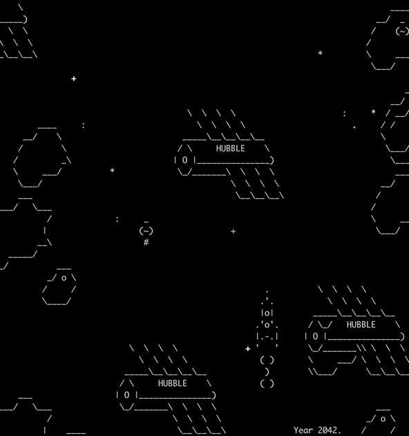

# Игра про космос

Прототип космической игры в терминале. Ракета среди мерцающих звезд. Движением ракеты можно управлять с клавиатуры.



## Установка

Python3 должен быть установлен. Используйте pip (или pip3, если есть конфликт с Python2) для установки зависимостей:

```
pip install -r requirements.txt
```

Перед запуском инициализируются следующие переменные окружения в env файле:
- `ROCKET_SPEED` - Скорость движения ракеты, по умолчанию 1.

## Запуск

Запускают скрипт без параметров:


```
python.exe main.py
```

## Цели проекта

Код написан в учебных целях — это урок в курсе по Python [Devman](https://dvmn.org).
